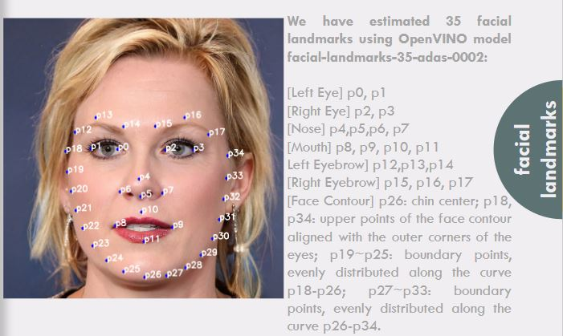

# Glass Frame Preview

<a id='index'></a>
## Table of Contents
- [Project Overview](#overview)
- [How AI works](#works)
- [Infrastructure Diagram](#diagram)
- [CloudFormation](#cloudformation)
- [References](#ref)


<a id='video'></a>
**_[Deployed App](http://exampleframe.com.s3-website.ca-central-1.amazonaws.com/)_**


**_[Presentation](https://docs.google.com/presentation/d/1dR0kyp0K7dAWPLHHLWCjR6mkAK-vTtT0cLlMxEoJp7o/edit?usp=sharing)_**


<hr/> 

[Back to Table of Content](#index)


<a id='overview'></a>
## Project Overview
When someone wants to get a new glass frame, he/she has to go through a process of trial and error. Maybe he/she finds some eyeglasses attractive on display in the optical shop, but not so great when he/she try them on. Depending on face shapes, skin tones, hair color and eye color, a certain glass frame looks awesome to a certain person. So, sometimes it become quite hard for a person to choose a right glass frame in a optical shop. <br/>
Artificial Intelligence (AI) can come as rescue in this scenario. AI is already changing almost every spheres of our lives. With the recent advancement of deep learning technology and easily available cloud computing power, we can leverage AI to help us choose the right frame for us. This web app will show a basic usage of AI to help a person to choose a right glass frame virtually without all the hassles and dilemma.
  <br/>
<hr/> 

[Back to Table of Content](#index)
 
<a id='works'></a>
## Algorithm steps





<hr/> 

[Back to Table of Content](#index)

<a id='diagram'></a>
## Infrastructure Diagram

<hr/> 

[Back to Table of Content](#index)

<a id='cloudformation'></a>
## CloudFormation
A cloud formation template consists of multiple sections. Typical sections include the template's format version, description, parameters, resources, and outputs. 
1. The format version defines the format in which this template is written. This is allows the cloud formation servers to use the correct interpreters for each template, thus enabling users to continue to use the older versions, even when newer format versions have been released. 
1. The description field is just a human-readable description of the template, intended to provide the template user with instructions and information. 
1. Parameters section consists of a list of parameters that are used in the template, and anyone who wants to use this template must provide the parameter values in order to create a stack from it. The onus is on the template developer to decide what values they would accept as parameters, and which ones they would like to fix in the template. Values typically exposed as parameters are the values that often change between similar stacks, for example names, number of instances, instance types, etc. 
1. The single most important section of a cloud formation template is the resources section, because, after all, the primary job here is to provision the resources. So in here we would have a list of resources, and those resources could include instances, security groups, S3 buckets, VPCs, etc. 
1. Typically, the last section of a cloud formation template is outputs. Outputs specify the values from the template that the template developer feels should be easy to access in a given stack. These can be accessed easily via the AWS console, or the CLI or API. A classic example of an output is the endpoint of an ELB. When provisioning a web stack, it is usually the single most important piece of information a user would want to access after deploying the stack, because it is the endpoint that they will use to check if the template has deployed correctly. By making this endpoint an output, the user can access the endpoint from the outputs console, and test the stack conveniently. Once a template contains some or all of these sections, it can be used to create a cloud formation stack.
<hr/> 
JSON File

```
{
  "AWSTemplateFormatVersion" : "2010-09-09",

  "Description" : "AWS CloudFormation Sample Template S3_Website_Bucket_With_Retain_On_Delete: Sample template showing how to create a publicly accessible S3 bucket configured for website access with a deletion policy of retail on delete. **WARNING** This template creates an S3 bucket that will NOT be deleted when the stack is deleted. You will be billed for the AWS resources used if you create a stack from this template.",

  "Resources" : {
    "S3Bucket" : {
      "Type" : "AWS::S3::Bucket",
      "Properties" : {
        "AccessControl" : "PublicRead",
        "WebsiteConfiguration" : {
          "IndexDocument" : "index.html",
          "ErrorDocument" : "error.html"      
         }
      },
      "DeletionPolicy" : "Retain"
    },
    "mybucketpolicy" : {
      "Type" : "AWS::S3::BucketPolicy",
      "Properties" : {
         "PolicyDocument" : {
            "Version":"2012-10-17",
            "Statement":[{
	       "Sid":"PublicReadGetObject",
               "Effect":"Allow",
	       "Principal": "*",
               "Action":["s3:GetObject"],
               "Resource" : { "Fn::Join" : [ 
               "", [ "arn:aws:s3:::", { "Ref" : "S3Bucket" } , "/*" ]
               ] }
             }]
         },
        "Bucket" : { "Ref" : "S3Bucket" }
      }
    }
   },

  "Outputs" : {
    "WebsiteURL" : {
      "Value" : { "Fn::GetAtt" : [ "S3Bucket", "WebsiteURL" ] },
      "Description" : "URL for website hosted on S3"
    }
  } 
}
```

[Back to Table of Content](#index)

<a id='ref'></a>
## References
1. [Host a Static Website](https://aws.amazon.com/getting-started/projects/host-static-website/)
1. [AWS CloudFormation User Guide](https://docs.aws.amazon.com/AWSCloudFormation/latest/UserGuide/sample-templates-services-us-west-2.html#w2ab1c28c58c13c35)
1. [URL of Deployed App](http://exampleframe.com.s3-website.ca-central-1.amazonaws.com/)
1. [The best glasses for your face shape and skin tone](https://www.allaboutvision.com/eyeglasses/eyeglasses_shape_color_analysis.htm)
<hr/> 

[Back to Table of Content](#index)