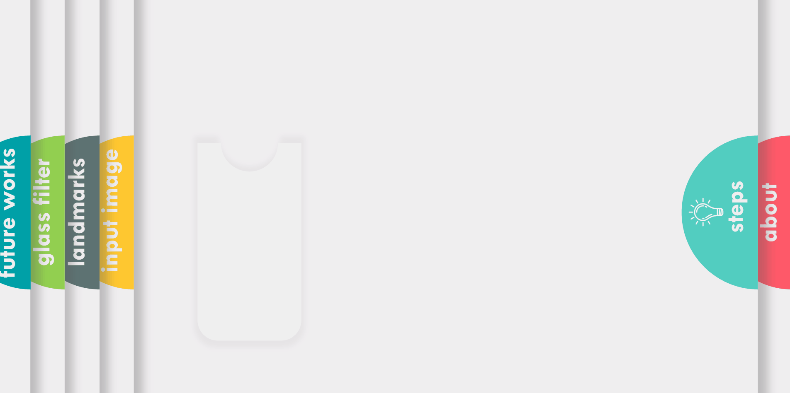

# Glass Frame Preview

<a id='index'></a>
## Table of Contents
- [Project Overview](#overview)
- [Algorithmic Steps](#works)
- [Usage](#usage)
- [Code](#code)
- [Future Works](#future)
- [References](#ref)


<a id='video'></a>
**_[Deployed App](http://exampleframe.com.s3-website.ca-central-1.amazonaws.com/)_**


**_[Presentation](https://docs.google.com/presentation/d/1dR0kyp0K7dAWPLHHLWCjR6mkAK-vTtT0cLlMxEoJp7o/edit?usp=sharing)_**


<hr/> 

[Back to Table of Content](#index)


<a id='overview'></a>
## Project Overview
When someone wants to get a new glass frame, he/she has to go through a process of trial and error. Maybe he/she finds some eyeglasses attractive on display in the optical shop, but not so great when he/she try them on. Depending on face shapes, skin tones, hair color and eye color, a certain glass frame looks awesome to a certain person. So, sometimes it become quite hard for a person to choose a right glass frame in a optical shop. <br/>
Artificial Intelligence (AI) can come as rescue in this scenario. AI is already changing almost every spheres of our lives. With the recent advancement of deep learning technology and easily available cloud and edge computing power, we can leverage AI to help us choose the right glass frame for us. This web app will show a basic usage of AI with Intel OpenVINO toolkit to help a person to choose a right glass frame virtually without all the hassles and dilemma.
  <br/>
<hr/> 

[Back to Table of Content](#index)
 
<a id='works'></a>
## Algorithmic Steps



### Step 1: Input Image Preprocessing


### Step 2: Facial Landmarks Estimation


### Step 3: Overlay Transparent Filter


Refer to the [Code](#code) for more details.

<hr/> 

[Back to Table of Content](#index)

<a id='usage'></a>
## Usage
### Initialize OpenVINO environment


### Facial Landmarks model
```
python app.py -i "images/person1.jpg" -t "FACIAL" -m "models/facial-landmarks-35-adas-0002.xml"
```
### Overlay Glass Filter
```
python app.py -i "images/person1.jpg" -t "GLASS" -m "models/facial-landmarks-35-adas-0002.xml" -g "images/glasses/glass9.png"
```
### Age and Gender Model
```
python app.py -i "images/person1.jpg" -t "GENDER" -m "models/age-gender-recognition-retail-0013.xml"
```

<hr/> 

[Back to Table of Content](#index)

<a id='code'></a>
## Code
### Handle Facial Landmarks Metadata Model
```
def handle_facial(output, input_shape):
    '''
    Handles the output of the Facial landmarks Metadata model.
    Returns the coordinates of 35 facial landmarks.
    '''
    #print(output.keys())
    fc=output['align_fc3']
    
    coords=[]
    for i in range(0,len(fc[0]),2):
        x=int(fc[0][i]*input_shape[1])
        y=int(fc[0][i+1]*input_shape[0])
        coords.append(x)
        coords.append(y)
    return coords
```
### Handle Age and Gender Model
```
def handle_gender(output, input_shape):
    '''
    Handles the output of the Gender and Age Metadata model.
    Returns the age and gender: argmax of softmax output
    '''
    #print(output.keys())
    age=int(output["age_conv3"].flatten()[0]*100)
    gender_type=output["prob"].flatten()
    gender_class=np.argmax(gender_type) 

    return age, gender_class

```
### Output Facial Landmarks Model Image
```
    if model_type == "FACIAL":
        for i in range(0,len(output),2):
            cv2.circle(image, (output[i],output[i+1]), 4, (255, 0, 0), -1)

            font                   = cv2.FONT_HERSHEY_SIMPLEX
            bottomLeftCornerOfText = (output[i],output[i+1])
            fontScale              = 0.7
            fontColor              = (255,255,255)
            lineType               = 2

            cv2.putText(image,'p'+str(int(i/2)), 
                bottomLeftCornerOfText, 
                font, 
                fontScale,
                fontColor,
                lineType)             
        return image
```
### Ouput Glass Filter Model Image
```
    if model_type == "GLASS":
        image_copy = np.copy(image)
        glasses=cv2.imread(glass,-1)
        scale=((output[36]-output[68])**2+(output[37]-output[69])**2)**(1/2.0)
        glasses=cv2.resize(glasses,(int(scale),int(scale*glasses.shape[0]/glasses.shape[1])))
        translation_vertical=int((output[1]+output[5])/2-glasses.shape[1]/2)
        translation_horizontal=int((output[0]+output[4])/2-glasses.shape[0]/2)
        gw,gh,gc = glasses.shape
        for i in range(0,gw):       # Overlay the filter based on the alpha channel(glass)
            for j in range(0,gh):
                if glasses[i,j][3] != 0:
                    image[i+translation_vertical,j+translation_horizontal]=glasses[i,j][:-1]
        return image
```
### Output Age and Gender Model Image
```
    if model_type == "GENDER":
        #print(output[0], output[1])
        age = output[0]
        #print(age)
        gender_type = GENDER_TYPES[output[1]]
        #print(gender_type)
        scaler = max(int(image.shape[0] / 5000), 1)
        image = cv2.putText(image, 
            "{},{} ".format(age,gender_type), 
            (20, image.shape[0]-10), cv2.FONT_HERSHEY_SIMPLEX, 
            2 * scaler, (0,255, 0), 3 * scaler)
        return image
```
<hr/>

[Back to Table of Content](#index)

<a id='future'></a>
## Future Works


<hr/>

[Back to Table of Content](#index)

<a id='ref'></a>
## References
1. [URL of Deployed App](http://exampleframe.com.s3-website.ca-central-1.amazonaws.com/)
1. [Presentation](https://docs.google.com/presentation/d/1dR0kyp0K7dAWPLHHLWCjR6mkAK-vTtT0cLlMxEoJp7o/edit?usp=sharing)
1. [The best glasses for your face shape and skin tone](https://www.allaboutvision.com/eyeglasses/eyeglasses_shape_color_analysis.htm)
1. [Host a Static Website](https://aws.amazon.com/getting-started/projects/host-static-website/)
<hr/> 

[Back to Table of Content](#index)